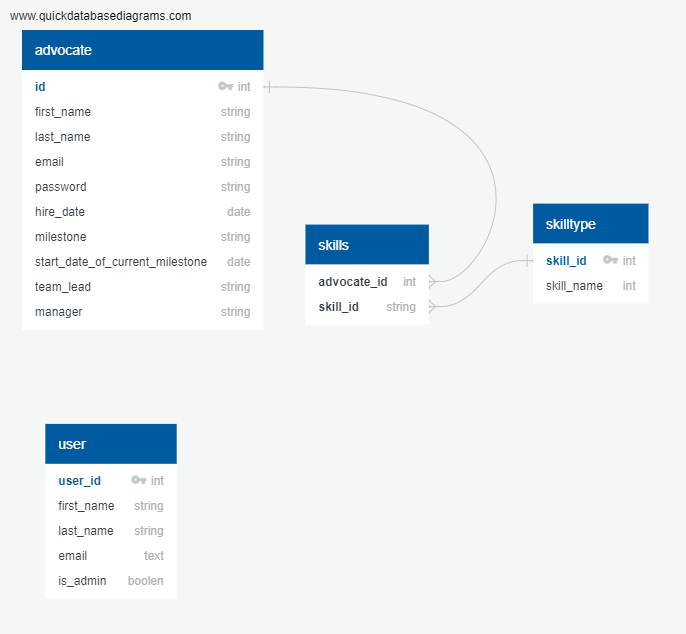

## Capstone 2

### Basic Database Schema (Subject to Change)

# Advocate App

This app was designed to be an extension of an already exisiting app at my place of work.

## The Problem:

All the advocates information in the department I work with is all housed in google sheets. It is very time consuming pull up the sheet waiting for the sheet to load because of all the data, then searching the file for a name or email.

## Solution:

Create an app that you can look up or scroll through to find the advocate that was a link which would then provide all the information regarding that advocate.

## User Flow:

Depending on the permissions of the user the user will have to create an accout. If the user has standard non-admin permissions they will be able to see the list of advocates and view their information. If the user is an admin they will have the additional view of adding or removing a skill along with editing advocate information along with adding or removing an advocate.

## API

I created my own API using Express.js with fake advocate data.

## Stack

The stack was PERN. Postgres, Express.js, React, and Node.js
